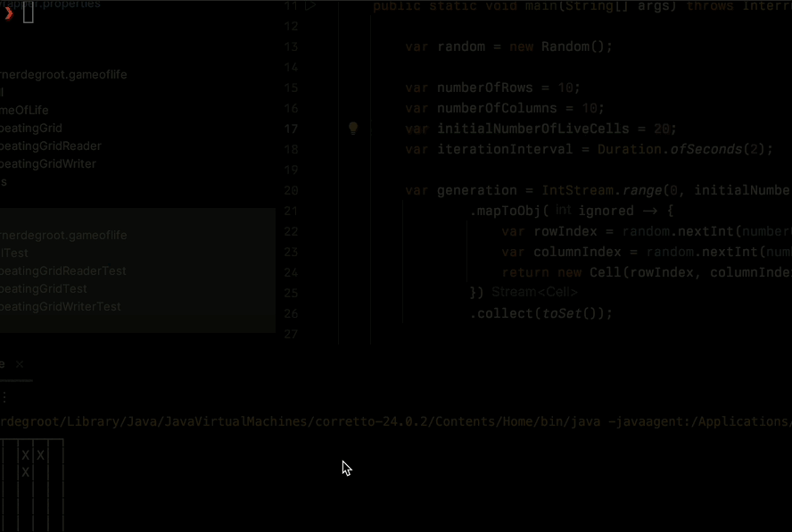

# Game of Life

Implements [Game of Life](https://nl.wikipedia.org/wiki/Game_of_Life) on the CLI.

## Principles

I find a lot of value in the [Ubiquitous Language](https://martinfowler.com/bliki/UbiquitousLanguage.html).

As such, I've tried to use the vocabulary I found online as much as possible (generation, live cells, dead cells, survivors, births, etc.)

For testing, I prefer to make the grid as "visual" as possible. That's why you see tests like the following use the visual examples I found on Wikipedia:

```java
@Test
void get_next_iteration_should_consider_overcrowding() {
    // See https://nl.wikipedia.org/wiki/Game_of_Life
    RepeatingGrid repeatingGrid = RepeatingGridReader.read("""
            ┌─┬─┬─┐
            │X│ │X│
            │ │X│ │
            │X│ │X│
            └─┴─┴─┘
            """);

    var toVerify = repeatingGrid.getNextIteration();

    assertTrue(toVerify.isDead(1, 1));
}
```

## Run tests, package and run

Disclaimer: I've designed this to work on *nix-like systems like macOS and Linux. No guarantees are given for Windows.

To run the unit tests, package the application you only need Java 21:

```shell
./mvnw clean package && ./mvnw exec:java
```

## What you should see

If you run the program, you will see a 10x10 grid with 20 live cells.

Every 2 seconds, the grid will update with the next iteration.



## Ideas for the future

- Allow the user to specify the grid dimensions and the initial number of live cells with command line parameters.
- Write a couple of tests that test the progression of certain common patterns like the Glider, the Blinker, the Tub, etc. (see https://en.wikipedia.org/wiki/Conway%27s_Game_of_Life#Examples_of_patterns)
- Make the `RepeatingGridReader` more robust and use it to allow a user to specify an initial grid as an ASCII diagram.
